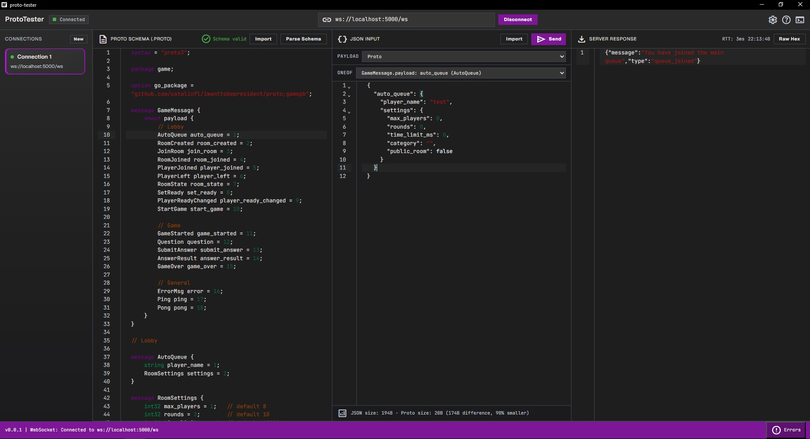

# Websocket Inspector

<p align="center">
	
</p>

Websocket Inspector is a desktop application (built with Wails + Go and a web frontend) for inspecting and testing
WebSocket connections and for decoding/validating messages encoded with Protobuf (.proto). The project helps
developers observe WebSocket traffic, decode binary messages using a chosen Protobuf schema, and send test messages.

**Key features**
- Load and edit `.proto` files in the UI.
- Parse and decode Protobuf messages received over WebSocket.
- Connect/disconnect to any WebSocket server (configurable URL).
- Send test messages (raw or Protobuf-encoded) to the server.
- Display received messages and compare JSON vs Protobuf sizes.

WARNING. You must have an oneof inside proto file.

**Project structure**
- Backend (Go): `main.go`, `app.go` (uses `wails` and `gorilla/websocket`).
- Frontend: `frontend/` (HTML/CSS/JS, uses `protobufjs`).
- Build artifacts: `build/`.

**Prerequisites**
- Go (version declared in `go.mod`: `1.23`).
- Node.js and npm (to install frontend dependencies).
- Wails v2 CLI (for local development and build): install with `go install github.com/wailsapp/wails/v2/cmd/wails@latest`.
- On Windows, ensure WebView2 Runtime is installed if using the native UI.

Installation and running (development)
1. Clone the repository and change into the project directory:

	```powershell
	git clone <repo-url>
	cd websocket-inspector
	```

2. Install the Wails CLI (if not already installed):

	```powershell
	go install github.com/wailsapp/wails/v2/cmd/wails@latest
	```

3. Install frontend dependencies:

	```powershell
	cd frontend
	npm install
	cd ..
	```

4. Start development mode (live reload + desktop app):

	```powershell
	wails dev
	```

	- In this mode the frontend is served by Vite and the Wails app connects to it.

Production build

1. To build redistributable packages (e.g. Windows, macOS, Linux):

	```powershell
	wails build
	```

2. Generated artifacts will be available in the `build/` directory.

Usage (quick guide)
- Open the application.
- Enter the WebSocket URL and click "Connect".
- Load a `.proto` file via the "Proto Schema" panel or paste the schema into the editor.
- Select the message type to use from the loaded schema.
- Incoming messages will be decoded automatically (if they match the loaded schema) and shown in the messages panel.
- Compose a test message in the send editor and send it as raw or Protobuf-encoded data.

Contributing
- Bug reports and pull requests are welcome. Please open an issue to discuss larger changes before implementing them.

License
- Check the repository files for license details (if provided).

Questions or issues
- Open an issue in the repository or contact the project owner for specific questions.

